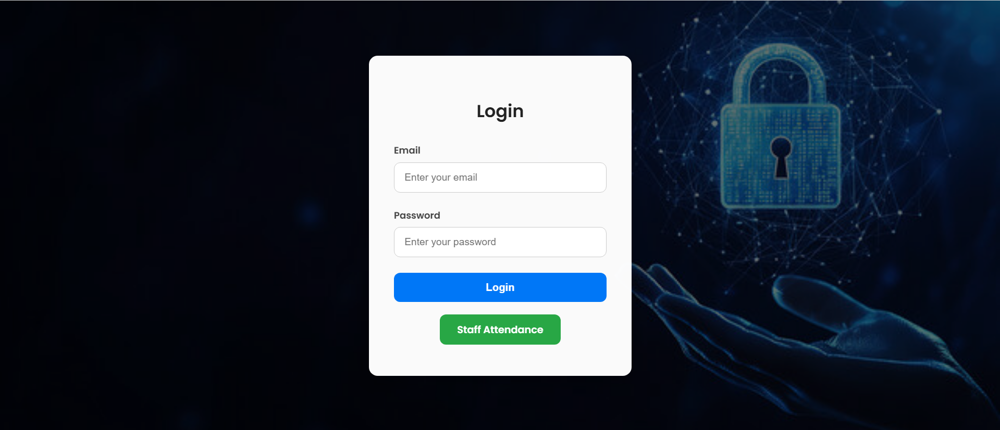
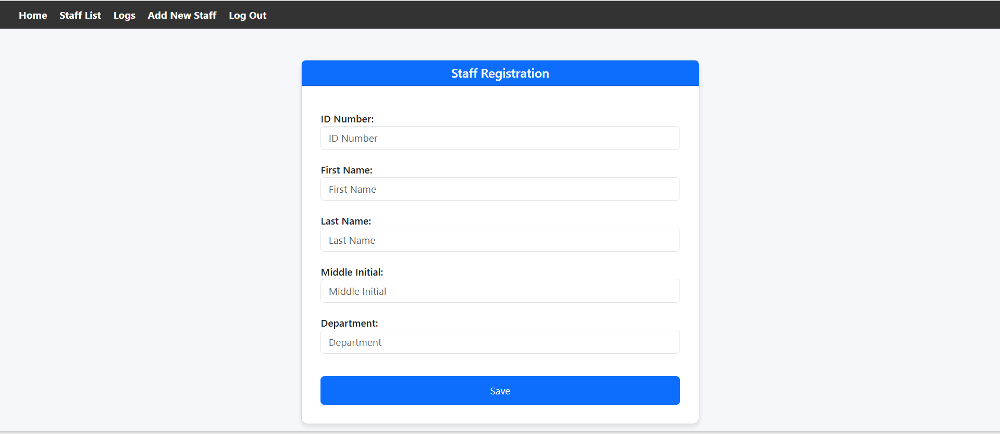
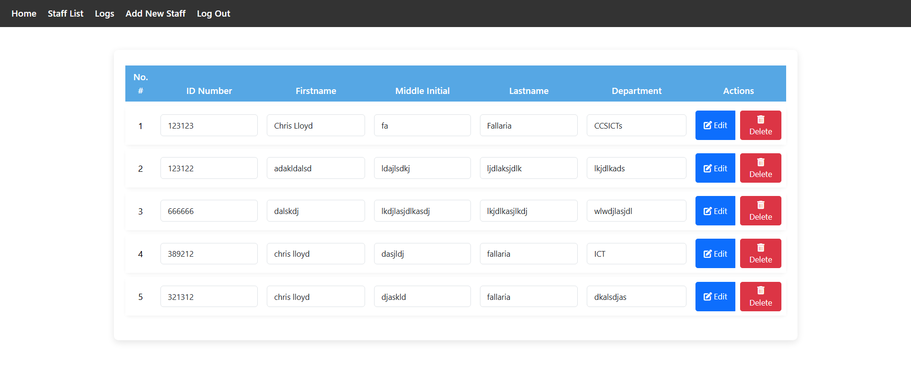
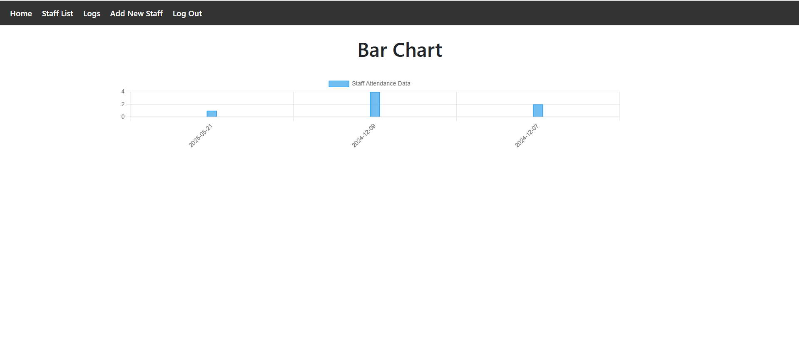
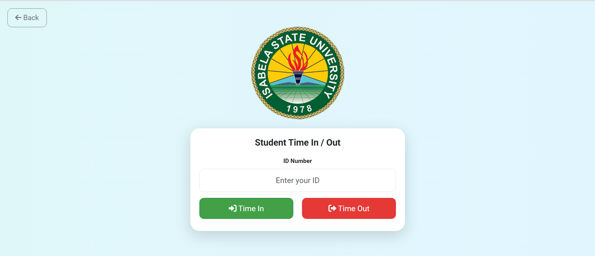
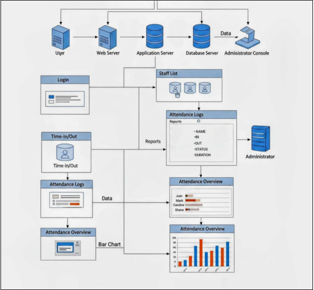

# Isabela State University Attendance System

## Members
- **Chris Lloyd Fallaria**
- **Princessmae Pinera**

## Software Description
The *Isabela State University Staff Attendance System* is a web-based platform designed to streamline and manage the attendance records of teaching personnel within the university. Developed using web technologies, this system provides functionalities for staff registration, logging of time-in and time-out, and generating attendance overviews. The system aims to replace traditional methods of attendance tracking with a more efficient and digital approach.

## Key Features of the System

- **Staff Registration:**  
  A module for administrators to add new staff members to the system, capturing essential details such as ID number, name, and department.

- **Time Logging:**  
  A user-friendly interface for staff members to record their time of arrival (Time-In) and departure (Time-Out).

- **Attendance Logs:**  
  A comprehensive record of staff attendance, displaying individual time-in and time-out entries along with the corresponding dates.

- **Staff List Management:**  
  A module to view and manage the registered staff members, allowing for editing and deletion of records.

- **Attendance Overview:**  
  A visual representation of attendance data through bar charts, providing insights into staff presence over specific periods.

- **Secure Login:**  
  A login portal for authorized users (likely administrators and potentially staff) to access the system's functionalities.

**Problems of the Existing System:**  
Based on observations, potential issues with the current manual attendance tracking methods at Isabela State University might include:

- **Potential for Manipulation:**  
  Manual records might be susceptible to tampering or inaccuracies.

- **Familiarity for Some Users:**  
  Staff who have been using manual systems for a while might find digital attendance systems a new concept, even though they are designed to simplify the process.

- **Direct Physical Evidence:**  
  Manual logs, when properly maintained, can offer direct physical evidence of attendance which might have been considered more reliable in the past.

## Scope of the Proposed System
The proposed system aims to address the limitations of manual attendance tracking by providing a digital and centralized platform. Its goal is to improve efficiency, accuracy, and accessibility of attendance management for teaching personnel.

**Key Features and Functionalities of the Proposed System Include:**

### User Management
- Staff registration with fields for ID Number, First Name, Last Name, Middle Initial, and Department.
- Functionalities for administrators to add, view, edit, and delete staff records.
- Secure login for system access.

### Attendance Tracking
- A dedicated interface for staff to log their Time In and Time Out.
- Automatic recording of timestamps for entry and exit.
- A comprehensive log displaying the date, Time In, and Time Out for each staff member.

### Attendance Reporting
- Generation of visual reports, such as bar charts, to summarize attendance data over specified periods.

### User Interface
- A web-based interface accessible through standard web browsers.
- A navigation menu for easy access to different modules (Home, Staff List, Logs, Add New Staff, Log Out).
- User-friendly forms for data input and display.
- Client-server architecture where the web interface (client) interacts with a server storing attendance data.

## Key Interfaces of the Staff Attendance System

### Login Page
Features fields for Email and Password, along with a "Login" button and a separate "Staff Attendance" button (potentially for a simplified time-in/out interface).

### Staff Registration Form
Includes input fields for "ID Number," "First Name," "Last Name," "Middle Initial," and "Department," with a "Save" button.

### Staff List
Displays a table with columns for "No. #," "ID Number," "Firstname," "Middle Initial," "Lastname," "Department," and "Actions" (with Edit and Delete buttons for each staff member).

### Attendance Logs
Presents a table with columns for "No. #," "ID Number," "Time In," and "Time Out," showing the timestamps of staff attendance records.

### Attendance Bar Chart
A visual representation of "Staff Attendance Data" over different dates (e.g., 2024-08-21, 2024-12-09, 2024-12-07).

### Student Time In/Out
A separate interface, possibly for a different user group (students), featuring an input field for "ID Number" and buttons for "Time In" and "Time Out," along with the Isabela State University logo.

### Wireframe
A visual layout of the system's interface design.

